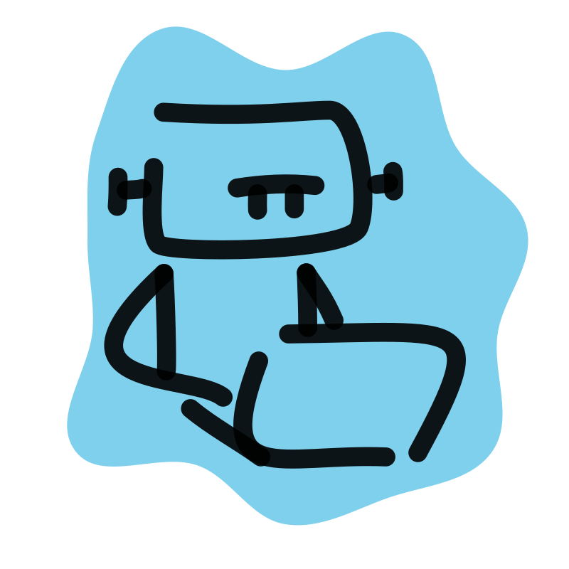

<a name="readme-top"></a>

[![Contributors][contributors-shield]][contributors-url]
[![Forks][forks-shield]][forks-url]
[![Stargazers][stars-shield]][stars-url]
[![Issues][issues-shield]][issues-url]
[![MIT License][license-shield]][license-url]
[![LinkedIn][linkedin-shield]][linkedin-url]

<!-- PROJECT LOGO -->
<br />
<div align="center">
  <a href="https://github.com/MateuszKrolik/Customer_Support_AI_ChatBot_BackEnd">
    
  </a>

<h3 align="center">Customer Support AI ChatBot BackEnd</h3>

  <p align="center">
    <br />
    <a href="https://github.com/MateuszKrolik/Customer_Support_AI_ChatBot_BackEnd"><strong>Explore the docs »</strong></a>
    <br />
    <br />
    <a href="https://github.com/MateuszKrolik/Customer_Support_AI_ChatBot_BackEnd">View Demo</a>
    ·
    <a href="https://github.com/MateuszKrolik/Customer_Support_AI_ChatBot_BackEnd/issues/new?assignees=&labels=bug&projects=&template=bug-report.md" >Report Bug</a>
    ·
    <a href="https://github.com/MateuszKrolik/Customer_Support_AI_ChatBot_BackEnd/issues/new?assignees=&labels=enhancement&projects=&template=feature-request.md">Request Feature</a>
  </p>
</div>

<!-- TABLE OF CONTENTS -->
<details>
  <summary>Table of Contents</summary>
  <ol>
    <li>
      <a href="#about-the-project">About The Project</a>
      <ul>
        <li><a href="#built-with">Built With</a></li>
      </ul>
    </li>
    <li>
      <a href="#getting-started">Getting Started</a>
      <ul>
        <li><a href="#prerequisites">Prerequisites</a></li>
        <li><a href="#installation">Installation</a></li>
      </ul>
    </li>
    <li><a href="#roadmap--usage">Roadmap</a></li>
    <li><a href="#contributing">Contributing</a></li>
    <li><a href="#license">License</a></li>
    <li><a href="#contact">Contact</a></li>
  </ol>
</details>

<!-- ABOUT THE PROJECT -->

## About The Project

To test out the API yourself, you can use the following 😉
link: [API Documentation](https://ys7jaqt5djj6zgrv5fktk5b7ky0iotut.lambda-url.eu-central-1.on.aws/docs)

https://github.com/user-attachments/assets/acd40a06-499c-4b97-8739-6e031532c955

<p align="right">(<a href="#readme-top">back to top</a>)</p>

### Built With

<!-- Programming Languages -->

- [![Python][Python.com]][Python-url]
- [![TypeScript][TypeScript.com]][TypeScript-url]
- [![Bash][Bash.com]][Bash-url]

<!-- Web Technologies -->

- [![FastAPI][FastAPI.com]][FastAPI-url]
- [![Uvicorn][Uvicorn.com]][Uvicorn-url]
- [![Pydantic][Pydantic.com]][Pydantic-url]

<!-- Cloud Deployment Services -->

- [![AWS][AWS.com]][AWS-url]
- [![AWS-Lambda][AWS-Lambda.com]][AWS-Lambda-url]
- [![AWS API Gateway][AWS-API-Gateway.com]][AWS-API-Gateway-url]
- [![AWS CDK][AWS-CDK.com]][AWS-CDK-url]
- [![AWS Systems Manager][AWS-Systems-Manager.com]][AWS-Systems-Manager-url]
- [![AWS_ECR][AWS_ECR]][AWS_ECR-url]
- [![AWS_Cloud_Formation][AWS_Cloud_Formation]][AWS_Cloud_Formation-url]
- [![AWS IAM][AWS-IAM.com]][AWS-IAM-url]

<!-- DataBases -->

- [![DynamoDB][DynamoDB.com]][DynamoDB-url]
- [![ChromaDB][ChromaDB.com]][ChromaDB-url]

<!-- AI/ML -->

- [![AWS Bedrock][AWS-Bedrock.com]][AWS-Bedrock-url]
- [![Langchain][Langchain.com]][Langchain-url]
- [![Anthropic Claude][Claude.com]][Claude-url]

<!-- DevTools -->

- [![Docker][Docker.com]][Docker-url]
- [![Linux][Linux.com]][Linux-url]
- [![Anaconda][Anaconda.com]][Anaconda-url]
- [![Swagger][Swagger.com]][Swagger-url]
- [![.ENV][Dotenv.com]][Dotenv-url]

<!-- DataFormats -->

- [![JSON][JSON.com]][JSON-url]
- [![YAML][YAML.com]][YAML-url]

<p align="right">(<a href="#readme-top">back to top</a>)</p>

<!-- GETTING STARTED -->

## Getting Started

When setting up the project locally, I suggest adding your own custom environment variables via a .env file,
as well as on AWS side using AWS Systems Manager.

### Prerequisites

You should have Python3, AWS CLI, AWS CDK and Docker installed.

I also suggest setting up a Python virtual environment via Anaconda.

### Installation

1. Clone the repo
   ```sh
   git clone https://github.com/MateuszKrolik/Customer_Support_AI_ChatBot_BackEnd.git
   ```

<p align="right">(<a href="#readme-top">back to top</a>)</p>

<!-- ROADMAP & USAGE -->

## Roadmap & Usage

- [x] AI/ML Agent via LangChain LLM FrameWork and AWS BedRock Service with Claude Anthropic Model
- [x] RecursiveTextSplitting using LangChain for better fitting of Large Text/PDF File data in LLMs context window
- [x] Retrieval Augmented Generation (RAG) for enhancing LLM with long-term, up-to-date memory
- [x] ChromaDB for storage of Vector Embeddings/Representations of Text/PDF Unstructured Data as Points in
  Multi-Dimensional Space
- [x] Similarity Search with Relevance Scores using the HNSW Algorithm with a Cosine Similarity metric
- [x] AWS DynamoDB NoSQL Key-Value DataBase for storage and retrieval of FAQ's/user queries
- [x] FastAPI FrameWork for BackEnd REST API EndPoints and future FrontEnd OpenAPI Client Schema Generation
- [x] Uvicorn ASGI Server with a Mangum Library Handler Adapter Wrapper for AWS Lambda Deployment
- [x] Singleton Design Pattern for Global State Consistency and Single Instantiation of Vector Storage
- [x] Pydantic for Data Validation
- [x] Infrastructure-as-Code (IaC) via:
    - [x] Docker
    - [x] TypeScript
    - [x] AWS Cloud Formation
    - [x] AWS Lambda
    - [x] AWS API Gateway
    - [x] AWS Cloud Development Kit (CDK)
    - [x] AWS Systems Manager
    - [x] AWS AWS IAM
- [x] Cross-Origin Resource Sharing (CORS) for future FrontEnd API access

See the [open documentation](https://github.com/MateuszKrolik/Customer_Support_AI_ChatBot_BackEnd/issues) for a full
list of proposed features (and
known issues).

<p align="right">(<a href="#readme-top">back to top</a>)</p>

<!-- CONTRIBUTING -->

## Contributing

Contributions are what make the open source community such an amazing place to learn, inspire, and create. Any
contributions you make are **greatly appreciated**.

If you have a suggestion that would make this better, please fork the repo and create a pull request. You can also
simply open an issue with the tag "enhancement".
Don't forget to give the project a star! Thanks again!

1. Fork the Project
2. Create your Feature Branch (`git checkout -b feature/AmazingFeature`)
3. Commit your Changes (`git commit -m 'Add some AmazingFeature'`)
4. Push to the Branch (`git push origin feature/AmazingFeature`)
5. Open a Pull Request

<p align="right">(<a href="#readme-top">back to top</a>)</p>

<!-- LICENSE -->

## License

Distributed under the MIT License. See `LICENSE` for more information.

<p align="right">(<a href="#readme-top">back to top</a>)</p>

<!-- CONTACT -->

## Contact

Mateusz Królik - mateuszkrolik87@gmail.com

Project
Link: [https://ys7jaqt5djj6zgrv5fktk5b7ky0iotut.lambda-url.eu-central-1.on.aws/docs](https://ys7jaqt5djj6zgrv5fktk5b7ky0iotut.lambda-url.eu-central-1.on.aws/docs)

Project Repository
Link: [https://github.com/MateuszKrolik/Customer_Support_AI_ChatBot_BackEnd](https://github.com/MateuszKrolik/Customer_Support_AI_ChatBot_BackEnd)

<p align="right">(<a href="#readme-top">back to top</a>)</p>


<!-- MARKDOWN LINKS & IMAGES -->
<!-- https://www.markdownguide.org/basic-syntax/#reference-style-links -->

[contributors-shield]: https://img.shields.io/github/contributors/MateuszKrolik/Customer_Support_AI_ChatBot_BackEnd.svg?style=for-the-badge

[contributors-url]: https://github.com/MateuszKrolik/Customer_Support_AI_ChatBot_BackEnd/graphs/contributors

[forks-shield]: https://img.shields.io/github/forks/MateuszKrolik/Customer_Support_AI_ChatBot_BackEnd.svg?style=for-the-badge

[forks-url]: https://github.com/MateuszKrolik/Customer_Support_AI_ChatBot_BackEnd/network/members

[stars-shield]: https://img.shields.io/github/stars/MateuszKrolik/Customer_Support_AI_ChatBot_BackEnd.svg?style=for-the-badge

[stars-url]: https://github.com/MateuszKrolik/Customer_Support_AI_ChatBot_BackEnd/stargazers

[issues-shield]: https://img.shields.io/github/issues/MateuszKrolik/Customer_Support_AI_ChatBot_BackEnd.svg?style=for-the-badge

[issues-url]: https://github.com/MateuszKrolik/Customer_Support_AI_ChatBot_BackEnd/issues

[license-shield]: https://img.shields.io/github/license/MateuszKrolik/Customer_Support_AI_ChatBot_BackEnd.svg?style=for-the-badge

[license-url]: https://github.com/MateuszKrolik/Customer_Support_AI_ChatBot_BackEnd/blob/master/LICENSE.txt

[linkedin-shield]: https://img.shields.io/badge/-LinkedIn-black.svg?style=for-the-badge&logo=linkedin&colorB=555

[linkedin-url]: https://www.linkedin.com/in/mateusz-kr%C3%B3lik-8b1862262/

[product-screenshot]: images/screenshot.png

[AWS.com]: https://img.shields.io/badge/AWS-%23FF9900.svg?style=for-the-badge&logo=amazonaws&logoColor=white

[AWS-url]: https://aws.amazon.com/

[Linux.com]: https://img.shields.io/badge/Linux-FCC624?style=for-the-badge&logo=linux&logoColor=black

[Linux-url]: https://www.linux.org/

[Python.com]: https://img.shields.io/badge/Python-%233776AB.svg?style=for-the-badge&logo=python&logoColor=white

[Python-url]: https://www.python.org/

[Uvicorn.com]: https://img.shields.io/badge/uvicorn-%23009639.svg?style=for-the-badge&logo=gunicorn&logoColor=white

[Uvicorn-url]: https://www.uvicorn.org/

[AWS-Lambda.com]: https://img.shields.io/badge/aws_lambda-%23E34F26.svg?style=for-the-badge&logo=aws-lambda&logoColor=white

[AWS-Lambda-url]: https://www.aws.com/

[AWS-Lambda.com]: https://img.shields.io/badge/aws_lambda-%23E34F26.svg?style=for-the-badge&logo=aws-lambda&logoColor=white

[AWS-Lambda-url]: https://www.aws.com/

[AWS-CDK.com]: https://img.shields.io/badge/AWS%20CDK-232F3E?style=for-the-badge&logo=aws&logoColor=white

[AWS-CDK-url]: https://aws.amazon.com/cdk/

[AWS-Systems-Manager.com]: https://img.shields.io/badge/AWS%20Systems%20Manager-4CAF50?style=for-the-badge&logo=aws&logoColor=white

[AWS-Systems-Manager-url]: https://aws.amazon.com/systems-manager/

[AWS-IAM.com]: https://img.shields.io/badge/AWS%20IAM-FF9900?style=for-the-badge&logo=aws&logoColor=white

[AWS-IAM-url]: https://aws.amazon.com/iam/

[TypeScript.com]: https://img.shields.io/badge/TypeScript-007ACC?style=for-the-badge&logo=typescript&logoColor=white

[TypeScript-url]: https://www.typescriptlang.org/

[Docker.com]: https://img.shields.io/badge/Docker-2496ED?style=for-the-badge&logo=docker&logoColor=white

[Docker-url]: https://www.docker.com/

[AWS_ECR-url]: https://site.AWS_ECR.org/

[AWS_ECR]: https://img.shields.io/badge/AWS_ECR-D97706?style=for-the-badge&logo=data:image/svg+xml;base64,PD94bWwgdmVyc2lvbj0iMS4wIiBlbmNvZGluZz0iVVRGLTgiPz4KPHN2ZyB3aWR0aD0iODBweCIgaGVpZ2h0PSI4MHB4IiB2aWV3Qm94PSIwIDAgODAgODAiIHZlcnNpb249IjEuMSIgeG1sbnM9Imh0dHA6Ly93d3cudzMub3JnLzIwMDAvc3ZnIiB4bWxuczp4bGluaz0iaHR0cDovL3d3dy53My5vcmcvMTk5OS94bGluayI+CiAgICA8IS0tIEdlbmVyYXRvcjogU2tldGNoIDY0ICg5MzUzNykgLSBodHRwczovL3NrZXRjaC5jb20gLS0+CiAgICA8dGl0bGU+SWNvbi1BcmNoaXRlY3R1cmUvNjQvQXJjaF9BbWF6b24tRWxhc3RpYy1Db250YWluZXItUmVnaXN0cnlfNjQ8L3RpdGxlPgogICAgPGRlc2M+Q3JlYXRlZCB3aXRoIFNrZXRjaC48L2Rlc2M+CiAgICA8ZGVmcz4KICAgICAgICA8bGluZWFyR3JhZGllbnQgeDE9IjAlIiB5MT0iMTAwJSIgeDI9IjEwMCUiIHkyPSIwJSIgaWQ9ImxpbmVhckdyYWRpZW50LTEiPgogICAgICAgICAgICA8c3RvcCBzdG9wLWNvbG9yPSIjQzg1MTFCIiBvZmZzZXQ9IjAlIj48L3N0b3A+CiAgICAgICAgICAgIDxzdG9wIHN0b3AtY29sb3I9IiNGRjk5MDAiIG9mZnNldD0iMTAwJSI+PC9zdG9wPgogICAgICAgIDwvbGluZWFyR3JhZGllbnQ+CiAgICA8L2RlZnM+CiAgICA8ZyBpZD0iSWNvbi1BcmNoaXRlY3R1cmUvNjQvQXJjaF9BbWF6b24tRWxhc3RpYy1Db250YWluZXItUmVnaXN0cnlfNjQiIHN0cm9rZT0ibm9uZSIgc3Ryb2tlLXdpZHRoPSIxIiBmaWxsPSJub25lIiBmaWxsLXJ1bGU9ImV2ZW5vZGQiPgogICAgICAgIDxnIGlkPSJJY29uLUFyY2hpdGVjdHVyZS1CRy82NC9Db250YWluZXJzIiBmaWxsPSJ1cmwoI2xpbmVhckdyYWRpZW50LTEpIj4KICAgICAgICAgICAgPHJlY3QgaWQ9IlJlY3RhbmdsZSIgeD0iMCIgeT0iMCIgd2lkdGg9IjgwIiBoZWlnaHQ9IjgwIj48L3JlY3Q+CiAgICAgICAgPC9nPgogICAgICAgIDxwYXRoIGQ9Ik0zOC43ODgwNzQxLDM3LjU3NzY5NDUgQzM4LjI5MzM4NDUsMzcuODY1NTEyNSAzNy45ODU1Nzc3LDM4LjQwMDAzMTcgMzcuOTg1NTc3NywzOC45NzM2NjIgTDM3Ljk4NTU3NzcsNjYuNzE5NTE4NiBMMTYuOTk4NzQ1OSw1NC45ODQxNjU1IEwxNi45OTg3NDU5LDI3LjcwNzY0MjggTDQwLjU1Njk2NDMsMTQuMDU4ODUxNSBMNjEuNDg0ODMzLDI0LjQyODMyMjYgTDM4Ljc4ODA3NDEsMzcuNTc3Njk0NSBaIE02My45MjAzMDQ5LDI0LjQwMjI0ODUgQzYzLjkyMDMwNDksMjMuODI3NjE1MyA2My42MTM0OTc0LDIzLjI5MjA5MzMgNjMuMDU5ODQ0OCwyMi45NzUxOTI3IEw0MS4zNDY0Njg5LDEyLjIxNDYwOTkgQzQwLjg1MDc3OTksMTEuOTI4Nzk3NiA0MC4yMzUxNjYyLDExLjkyNzc5NDggMzkuNzQwNDc2NiwxMi4yMTU2MTI4IEwxNS44MDI0OTY1LDI2LjA4NDAyODMgQzE1LjMwNzgwNjksMjYuMzcxODQ2MyAxNSwyNi45MDYzNjU1IDE1LDI3LjQ3OTk5NTggTDE1LDU1LjIxNTgyMzkgQzE1LDU1Ljc4OTQ1NDIgMTUuMzA3ODA2OSw1Ni4zMjM5NzM0IDE1LjgxNzQ4NzEsNTYuNjE5ODE0MiBMMzcuNTczODM2LDY4Ljc4NTM5MDEgQzM3LjgyMTY4MDUsNjguOTI4Nzk3NiAzOC4xMDA1MDU2LDY5IDM4LjM3ODMzMTIsNjkgQzM4LjY1NTE1NzUsNjkgMzguOTMzOTgyNiw2OC45Mjg3OTc2IDM5LjE4MDgyNzcsNjguNzg1MzkwMSBDMzkuNjc2NTE2Nyw2OC40OTg1NzQ5IDM5Ljk4NDMyMzYsNjcuOTY0MDU1NyAzOS45ODQzMjM2LDY3LjM4OTQyMjYgTDM5Ljk4NDMyMzYsMzkuMjAxMzA5IEw2My4xMTc4MDg0LDI1Ljc5ODIxNiBDNjMuNjEzNDk3NCwyNS41MTE0MDA4IDYzLjkyMDMwNDksMjQuOTc2ODgxNyA2My45MjAzMDQ5LDI0LjQwMjI0ODUgTDYzLjkyMDMwNDksMjQuNDAyMjQ4NSBaIE02My45NjkyNzQyLDU1LjA0NzM0NTEgTDQ0Ljk4MTE4ODMsNjYuNjYxMzUzMyBMNDQuOTgxMTg4Myw1Ni4yNjE3OTY3IEw1NC44ODE5NzYsNDkuODcyNjM4IEw1NC45NDk5MzM0LDQ5LjQyNDM2NCBDNTQuOTY3OTIyMSw0OS4zMDcwMzA1IDU0Ljk3NDkxNzcsNDkuMzA3MDMwNSA1NC45NzQ5MTc3LDQ4Ljc2NjQ5NDIgTDU1LjAwNTg5ODMsMzYuMzYwMjM0NCBMNjQuMDAwMjU0NywzMS4xNDg0MjE4IEw2My45NjkyNzQyLDU1LjA0NzM0NTEgWiBNNjUuMTk2NTA0MiwyOS4wNzE1MTkxIEM2NC42OTk4MTU4LDI4Ljc4MTY5NTMgNjQuMDg0MjAyMSwyOC43ODI2OTgyIDYzLjU4ODUxMzEsMjkuMDcxNTE5MSBMNTQuMDEzNTIwOSwzNC42MTgyODM1IEM1My43MTM3MDksMzQuNzgxNzQ4MSA1My4wMDgxNTE3LDM1LjE2NTgzOTggNTMuMDA4MTUxNywzNS45NTgwOTE0IEw1Mi45NzYxNzE4LDQ4LjcxNzM1NDYgTDQzLjg1MDg5NzUsNTQuNjA2MDkxIEM0My4zMDYyMzkyLDU0LjkzMTAxNDUgNDIuOTgyNDQyNCw1NS40NDU0NzY2IDQyLjk4MjQ0MjQsNTUuOTg5MDIxNCBMNDIuOTgyNDQyNCw2Ny4zMDgxOTE3IEM0Mi45ODI0NDI0LDY3Ljg3NDgwMjEgNDMuMjg3MjUxMSw2OC4zOTEyNjk5IDQzLjc5NzkzMDcsNjguNjg3MTEwNyBDNDQuMDY0NzYzMyw2OC44NDA1NDY4IDQ0LjM2MTU3Nyw2OC45MTg3NjkxIDQ0LjY1NzM5MTQsNjguOTE4NzY5MSBDNDQuOTQ4MjA5LDY4LjkxODc2OTEgNDUuMjM5MDI2NSw2OC44NDQ1NTgyIDQ1LjUwMTg2MTYsNjguNjkyMTI1IEw2NS4xNjc1MjIzLDU2LjY2MzkzOTYgQzY1LjY2MjIxMTksNTYuMzc2MTIxNiA2NS45NjgwMjAxLDU1Ljg0MTYwMjQgNjUuOTY4MDIwMSw1NS4yNzA5ODA3IEw2NiwzMC40NjY0ODM3IEM2NiwyOS44OTI4NTM0IDY1LjY5MjE5MzEsMjkuMzU4MzM0MiA2NS4xOTY1MDQyLDI5LjA3MTUxOTEgTDY1LjE5NjUwNDIsMjkuMDcxNTE5MSBaIiBpZD0iQW1hem9uLUVsYXN0aWMtQ29udGFpbmVyLVJlZ2lzdHJ5X0ljb25fNjRfU3F1aWQiIGZpbGw9IiNGRkZGRkYiPjwvcGF0aD4KICAgIDwvZz4KPC9zdmc+

[AWS_Cloud_Formation-url]: https://site.AWS_Cloud_Formation.org/

[AWS_Cloud_Formation]: https://img.shields.io/badge/AWS_Cloud_Formation-D6336C?style=for-the-badge&logo=data:image/svg+xml;base64,PD94bWwgdmVyc2lvbj0iMS4wIiBlbmNvZGluZz0iVVRGLTgiPz4KPHN2ZyB3aWR0aD0iODBweCIgaGVpZ2h0PSI4MHB4IiB2aWV3Qm94PSIwIDAgODAgODAiIHZlcnNpb249IjEuMSIgeG1sbnM9Imh0dHA6Ly93d3cudzMub3JnLzIwMDAvc3ZnIiB4bWxuczp4bGluaz0iaHR0cDovL3d3dy53My5vcmcvMTk5OS94bGluayI+CiAgICA8IS0tIEdlbmVyYXRvcjogU2tldGNoIDY0ICg5MzUzNykgLSBodHRwczovL3NrZXRjaC5jb20gLS0+CiAgICA8dGl0bGU+SWNvbi1BcmNoaXRlY3R1cmUvNjQvQXJjaF9BV1MtQ2xvdWRGb3JtYXRpb25fNjQ8L3RpdGxlPgogICAgPGRlc2M+Q3JlYXRlZCB3aXRoIFNrZXRjaC48L2Rlc2M+CiAgICA8ZGVmcz4KICAgICAgICA8bGluZWFyR3JhZGllbnQgeDE9IjAlIiB5MT0iMTAwJSIgeDI9IjEwMCUiIHkyPSIwJSIgaWQ9ImxpbmVhckdyYWRpZW50LTEiPgogICAgICAgICAgICA8c3RvcCBzdG9wLWNvbG9yPSIjQjAwODREIiBvZmZzZXQ9IjAlIj48L3N0b3A+CiAgICAgICAgICAgIDxzdG9wIHN0b3AtY29sb3I9IiNGRjRGOEIiIG9mZnNldD0iMTAwJSI+PC9zdG9wPgogICAgICAgIDwvbGluZWFyR3JhZGllbnQ+CiAgICA8L2RlZnM+CiAgICA8ZyBpZD0iSWNvbi1BcmNoaXRlY3R1cmUvNjQvQXJjaF9BV1MtQ2xvdWRGb3JtYXRpb25fNjQiIHN0cm9rZT0ibm9uZSIgc3Ryb2tlLXdpZHRoPSIxIiBmaWxsPSJub25lIiBmaWxsLXJ1bGU9ImV2ZW5vZGQiPgogICAgICAgIDxnIGlkPSJJY29uLUFyY2hpdGVjdHVyZS1CRy82NC9NYW5hZ2VtZW50LUdvdmVybmFuY2UiIGZpbGw9InVybCgjbGluZWFyR3JhZGllbnQtMSkiPgogICAgICAgICAgICA8cmVjdCBpZD0iUmVjdGFuZ2xlIiB4PSIwIiB5PSIwIiB3aWR0aD0iODAiIGhlaWdodD0iODAiPjwvcmVjdD4KICAgICAgICA8L2c+CiAgICAgICAgPHBhdGggZD0iTTUzLDM5Ljk2MzIwMzkgTDU4LDM5Ljk2MzIwMzkgTDU4LDM3Ljk2MDEzNzUgTDUzLDM3Ljk2MDEzNzUgTDUzLDM5Ljk2MzIwMzkgWiBNMjgsNTEuOTgxNjAxOSBMMzMsNTEuOTgxNjAxOSBMMzMsNDkuOTc4NTM1NiBMMjgsNDkuOTc4NTM1NiBMMjgsNTEuOTgxNjAxOSBaIE0xOCw1MS45ODE2MDE5IEwyNSw1MS45ODE2MDE5IEwyNSw0OS45Nzg1MzU2IEwxOCw0OS45Nzg1MzU2IEwxOCw1MS45ODE2MDE5IFogTTE4LDQ1Ljk3MjQwMjkgTDMwLDQ1Ljk3MjQwMjkgTDMwLDQzLjk2OTMzNjYgTDE4LDQzLjk2OTMzNjYgTDE4LDQ1Ljk3MjQwMjkgWiBNMTgsMzMuOTU0MDA0OCBMMjcsMzMuOTU0MDA0OCBMMjcsMzEuOTUwOTM4NSBMMTgsMzEuOTUwOTM4NSBMMTgsMzMuOTU0MDA0OCBaIE0xOCwzOS45NjMyMDM5IEw1MSwzOS45NjMyMDM5IEw1MSwzNy45NjAxMzc1IEwxOCwzNy45NjAxMzc1IEwxOCwzOS45NjMyMDM5IFogTTM3LDYxLjk5NjkzMzcgTDE0LDYxLjk5NjkzMzcgTDE0LDI3Ljk0NDgwNTggTDM3LDI3Ljk0NDgwNTggTDM3LDM1Ljk1NzA3MTIgTDM5LDM1Ljk1NzA3MTIgTDM5LDI2Ljk0MzI3MjYgQzM5LDI2LjM5MDQyNjMgMzguNTUyLDI1Ljk0MTczOTUgMzgsMjUuOTQxNzM5NSBMMTMsMjUuOTQxNzM5NSBDMTIuNDQ3LDI1Ljk0MTczOTUgMTIsMjYuMzkwNDI2MyAxMiwyNi45NDMyNzI2IEwxMiw2Mi45OTg0NjY4IEMxMiw2My41NTEzMTMxIDEyLjQ0Nyw2NCAxMyw2NCBMMzgsNjQgQzM4LjU1Miw2NCAzOSw2My41NTEzMTMxIDM5LDYyLjk5ODQ2NjggTDM5LDQyLjk2NzgwMzQgTDM3LDQyLjk2NzgwMzQgTDM3LDYxLjk5NjkzMzcgWiBNNjgsMzYuOTU4NjA0NCBDNjgsNDMuNDMwNTExNyA2Mi4xNzMsNDUuNjgxOTU4MyA1OS4wOTIsNDUuOTY4Mzk2OCBMNDMsNDUuOTcyNDAyOSBMNDMsNDMuOTY5MzM2NiBMNTksNDMuOTY5MzM2NiBDNTkuMTk1LDQzLjk0NjMwMTMgNjYsNDMuMjEyMTc3NSA2NiwzNi45NTg2MDQ0IEM2NiwzMS4yNjM4ODY3IDYwLjg2MywzMC4xMDgxMTc1IDU5LjgzNCwyOS45MzM4NTA3IEM1OS4zMjEsMjkuODQ2NzE3MyA1OC45NiwyOS4zODIwMDU5IDU5LjAwNCwyOC44NjMyMTE3IEM1OS4wMDUsMjguODQ0MTgyNiA1OS4wMDcsMjguODI2MTU1IDU5LjAwOSwyOC44MDgxMjc0IEM1OC45NTQsMjUuNTkwMjAxMyA1Ni45ODEsMjQuNTg0NjYyIDU2LjEyNiwyNC4zMDAyMjY2IEM1NC41MywyMy43Njk0MTQgNTIuNzUxLDI0LjI3NzE5MTMgNTEuODEsMjUuNTM5MTIzMSBDNTEuNTkxLDI1LjgzNTU3NjkgNTEuMjI5LDI1Ljk4NjgwODUgNTAuODYxLDI1LjkzMDcyMjYgQzUwLjQ5NywyNS44NzU2MzgzIDUwLjE5MiwyNS42MjUyNTUgNTAuMDY4LDI1LjI3NjcyMTQgQzQ5LjQ0NywyMy41MzYwNTY4IDQ4LjU0NiwyMi40MDgzMzA0IDQ3LjI5MywyMS4xNTM0MDk0IEM0NC4xNTksMTguMDM4NjQxMiAzOS45MDUsMTcuMTc4MzI0MiAzNS45MjUsMTguODUyODg3NyBDMzMuODM3LDE5LjczMzIzNTMgMzIuMDEyLDIxLjcyODI4OTQgMzAuOTIyLDI0LjMyNzI2OCBMMjkuMDc4LDIzLjU1MDA3ODIgQzMwLjM3LDIwLjQ3NDM2OTkgMzIuNTg0LDE4LjA4ODcxNzkgMzUuMTUsMTcuMDA3MDYyIEMzOS45MDUsMTUuMDA0OTk3MiA0NC45NzEsMTYuMDI1NTU5NSA0OC43MDQsMTkuNzM0MjM2OSBDNDkuNzc0LDIwLjgwNjg3ODkgNTAuNjYsMjEuODUxNDc4IDUxLjM1LDIzLjIwMzU0NzggQzUyLjg0MywyMi4wOTc4NTUxIDU0Ljg1NywyMS43NjczNDkyIDU2Ljc1NywyMi4zOTkzMTY2IEM1OS4xODksMjMuMjA4NTU1NCA2MC43MjcsMjUuMzIwNzg4OSA2MC45NzUsMjguMTI5MDg3OSBDNjQuMzgxLDI4Ljk4ODQwMzQgNjgsMzEuNzExNTcyMSA2OCwzNi45NTg2MDQ0IEw2OCwzNi45NTg2MDQ0IFoiIGlkPSJBV1MtQ2xvdWRGb3JtYXRpb25fSWNvbl82NF9TcXVpZCIgZmlsbD0iI0ZGRkZGRiI+PC9wYXRoPgogICAgPC9nPgo8L3N2Zz4=

[Langchain.com]: https://img.shields.io/badge/Langchain-000000?style=for-the-badge&logo=chainlink&logoColor=white

[Langchain-url]: https://www.langchain.com/

[Anaconda.com]: https://img.shields.io/badge/Anaconda-44A833?style=for-the-badge&logo=anaconda&logoColor=white

[Anaconda-url]: https://www.anaconda.com/

[Swagger.com]: https://img.shields.io/badge/Swagger-85EA2D?style=for-the-badge&logo=swagger&logoColor=black

[Swagger-url]: https://swagger.io/

[FastAPI.com]: https://img.shields.io/badge/FastAPI-009688?style=for-the-badge&logo=fastapi&logoColor=white

[FastAPI-url]: https://fastapi.tiangolo.com/

[AWS-API-Gateway.com]: https://img.shields.io/badge/AWS%20API%20Gateway-FF4F8B?style=for-the-badge&logo=amazon-api-gateway&logoColor=white

[AWS-API-Gateway-url]: https://aws.amazon.com/api-gateway/

[DynamoDB.com]: https://img.shields.io/badge/Amazon%20DynamoDB-4053D6?style=for-the-badge&logo=Amazon%20DynamoDB&logoColor=white

[DynamoDB-url]: https://aws.amazon.com/dynamodb/

[Claude.com]: https://img.shields.io/badge/Anthropic%20Claude-7A5FBF?style=for-the-badge&logo=anthropic&logoColor=white

[Claude-url]: https://www.anthropic.com/

[Pydantic.com]: https://img.shields.io/badge/Pydantic-E92063?style=for-the-badge&logo=pydantic&logoColor=white

[Pydantic-url]: https://pydantic-docs.helpmanual.io/

[Dotenv.com]: https://img.shields.io/badge/.ENV-ECD53F?style=for-the-badge&logo=dotenv&logoColor=black

[Dotenv-url]: https://github.com/theskumar/python-dotenv

[JSON.com]: https://img.shields.io/badge/JSON-000000?style=for-the-badge&logo=json&logoColor=white

[JSON-url]: https://www.json.org/

[YAML.com]: https://img.shields.io/badge/YAML-000000?style=for-the-badge&logo=yaml&logoColor=white

[YAML-url]: https://yaml.org/

[AWS-Bedrock.com]: https://img.shields.io/badge/AWS%20Bedrock-FFFFFF?style=for-the-badge&logo=data:image/png;base64,iVBORw0KGgoAAAANSUhEUgAAAPsAAADJCAMAAADSHrQyAAAA81BMVEX//////v////2lrbQiLDj6+ftZYWdAQk8WIzQLGi4AGSxUWWcWIDMjKTsfKzkAGiwEFCwVIC+qq7LCxcu3vMTy8vQ6QFCfp68AECZ3e4UAESxBTFcjLDwdJjixtboSHC7v8vEWJTJ0eYPp6uuutbaCiJSTmqFscngYIDUgLTdfanNgZXDd4OMdJTQgJzsXJC8rM0qOkJQpMT9CSVm8wcMOGSnP1tkqND/Y19+DiI0UHjYAACNHTl5kZmpnaHQzPkiioa1MUlhUWWkAByB9hZOko6Xn6OV4fIBzdoM/Rk0ADxywsbxNT1gbIj/IxtHV2tcAABV7aKhpAAASKklEQVR4nO1dC3uiuhZFigqVZIwWrcdEoFSEkWC1Pqq3R6d3Tk/bMz3T+/9/zU3oCwXpW+kMa76v09JoWe6d/Uh2NoKQIUOGDBkyZMiQIUOGDBkyZMiQIUOGDBkyZMiQIcOvBEMUxG3fw1Ygeu3TC2/bd7EVaJXizJQXdWvbN7Jx5Pe6ZR+40DRLLWPbN7NZjDs9hDGmAOOZ0x3+RpPeaxypGErILWAqYYJo4yS/7Xv6eORygmCd13SCIXJKVaP6J5Ix+37RZ0Yvt+27+1CIoqhVTmcUY6JfVwx2Jf/jTHeAT5Sibf3imp+vzgmCmDJB39t363yhEghldLanbfXePgxM4iKf6L5DAFHRxfjhF+xqf4CY1UOowI3eWs0P3uHu6+cCu2PLrpV97Mpqt7pi2k46UIHQnYGDcQL3lf8/EbTKtU4ANtFZ3Yj8krn7kQyAr5QSqOWt8XhsfTKPIPKJXlAdKFF98M2KKDZXY6116kNoFtaK3aoXrheLxVlhx/pUohfHF6aMAUSDqZdbc+ei1ZAZ93Xv0CrqjgMpVVXluvWJZO/1Fzoz5YBGJnoIolDZXcvdsKkjQQBlwiYG6p1/FvJGhTkx4DOF73K/tl5fd9ZxF0VbhiwOLDdLx/uBi7Q/hbXXWgWVsMidRXJyJ8mBi+Ja7kILQAj9y9aJdXLY8QmmtPUxd/ueyI0PoEwxHC3OIJY7RsJQxv3LGu7WqYqxcn77yWl1h7rov2lOfXnkLnhTrEKXqs5ltWXip+UO5FjuLRUAZN97B9GmEM/2PuCe3wtsQlr1K8R0VSbdYV5g3NEruYsFGatfH19rlWTsdNNs7oxWSfExhPpix2AiewN37czEo53Qhco+ds7SG/znxgWKoARmNTtYkssdmuC13L0rCCfV0IUqBWoztRM+358wXwSR1Di5m6SHpv967oTWxqEL4wkgqeUuGhOVJ2bd6kMC8ga5W02CpbDchzTV3BfMCRcqnOvb5a4x27ZfD42s72K5lNb5LhpFgvfDbugt3IWuCuSzx5V875pIzkFa7fwt97Cavon7ngxwb3pPNj9FGOvVuIFpgKgVZbDEXTg0nxHXMe5xOazWVX1oTm8l712YGKjdtKo8414jYH8YusL8O3w1d6GKHQDVY7vSqtjHDktmBqkVO+O+oMtyfxN3lt4iFsfK5e/sH8GAolZ6ly+43Jfnu9CiK3mceDMcDkOOKpF77seApTMsSpTYl9ngx7oFkDQgjjtW50Z4SAHRXigVTdJ5pjfVzowQlh1AqnfSq/AcUe6V77vfu0Z4SFcmoPUovmTubPx4umDMF9Nxas3cLaLcx327v7TOphVMip8tdz5AmCqS0njvW313RLmLdyn945CCTKVQ+PMM7m3F/ZTchdUtFcYdSC+Te7v8OeV+vy31OCTKfTeZu/iJ5b4y5KXcBc59968Ue7dbPIO79XtzpzHcE14htnd/be6Jcv9VuLPY5rfVeWbrcAx3FrsHcUAuhPsBvxB3M567GIdgSHv/F+FusJh2lbsvF/IJ+OsTyD0naEUacF+3Xcqua11TisgdLi4aBwcHjTgcNI6pxLinHJrtQizPk3bbLXvAsvEV7tSFSEbxUBGiGO+mPK7T9pqUQoxVcPBzDXuvvkAER+w8loIFihiw6xL/mmLuXMfHl1DGwCeMhAoug92JZc0XtfOzEYXQn6Fq+KWcO5AdOQRVVe+/Ndn3CH2/2CyhF8GbDvjmqy4tVBkCfzaI1MparSuZF5LqeP4zv7R2sYths/WjFcKPH0s/tlqVsZBWWHZRZ7oso69D69v1iFfHzECDaf4DR2OnpMoYUpnMh0sfSsC9VxDFsGcX738MBoi5lNbcsrsyhiWHuJDMisFulGfXdMo0XzlqeAF3ZtyHXQexiauTblVbnguBnUfdT1FIE0G+2hk5YADRwn6olbWbCgGYzOh0zN3aXheZbCKoqLuXX+X4dEybXniNgQIARpjRDF21a2pPYpq/mI6rXeBgydX9bsuIev6n87i0wjov6lCSTDk4BHHLi09XIe9NawqVpB6VTRNi30GFQyPuHd7CPbe1KtuckG/xWlkgm1c/YhaQT5jsiSSxaQ4Rul53POZtcjcsz/MsbeMzRhRaVPV9Mir2YwoCuOxPGoseZFYPnVWsdUXgb+FutQ4GxCe0W9/0mTNRqDBtJhI/7Mb90DICByXeXLBYB9sJxRJv4D7s7s94+SKQvze/bXpfnnE3TxOid4axgukgqU7k1XY+bxO+V8ejXtel5emGt20Yd3SQ/Dc/jLt4PiJQooRFvLLjA7/c3qzkK5BzTzS1jLt59P7cRaF6RFyzV2qdnHjVOWBxtF552Vu8ERXKuBuJQ8YKcJ/kzmLal3LXurovuf1bpcv/mJhur7hRgxfovJE4JOD+d8KA13EXqgj76KEWR2hBV1K/vfA93oTncn9S53uJa1ZxuJAxuX74TEXjAkH1enMzXhQZdz3EXTvvr4pPfJ7Ou5PiC4H9pdo7oaVTusG6wxXu+eqcTlbT7Gdyl4DjhNYrnoDqOI7PuD8at5wwPqZ0scEJf889ELZ3MaFY/nPV4411AJ8hdwyA60rPB4sW8Si88uWd0ugn/5F45M5PeOKBq0b+/HiE8eRpuVNdeQF2FX56Zj/s1G5qmG7U0N/rfL5aIirALG4/jMgdYfIkd9Br7lR2XoQmwbv245sIFRZDHW8ytON2/tIQTw4UGUqkXLON1RFGn7KYk+U6a9dl7ux8LnZbZi2EvoqD+X2XIhlzGcvdTaZzPLa59PpHCELggHZ0unmdHgYs+CuM1572faV/vyHMurB4+m7naqpC7Gz0EBWTO726clQI1XIpJqcZX6PbhXdUrGvrzkW+jnu+oWNcvuQzXBSsPqIYFTdaWs+4Q+Bj19Sb/KDvckGVIA4XKgD8gByE/v7Bmg4HAfe1Z0LXISd4NaZtyvF0b1ztl0YSJBuutWU6DzHAaNKOsbD5HWb6IboaVksKxkS9auXjRP/q/L06YSksRYMJVtnfgbK94TyOyR3TfzrVGE7GlBKMlS6b6VbDYR8Spe04pXw1d3E4GPFaU8isqa9TO/aT/Thw7vSsFTeVvT91FoHojYBuvlVTIPZnx9Wo1r9h3cbrTHZVQmT5i3w23DD1wNaV4pI0Ufz2nSmk2jfuLpxcMtG75iDqBe9qC1/198Vh/+D6qjlvxy2VfjAqcCmXeUROtLq6PAlNQa0usVhMnUQMw5u4swTub8/b/DKtEMhdXcNd8K6vHg5Q5Hjd+3iuEOU8ophP1pQ+B+LmN+xWctgliDc3K1esKY05NcS5Y7qu3iam+iYlSOIeg/w4xhXeyr27tA27BqkquXkZ91ysXgbc8aBQehL/7axq0jbxQrnHgnOXWOhzV26RgFl5nqJWJ+/HHUrSk0sXLi4/sRmwSbwf995oVH4KLE9WNrwBkYB34r4LSPO8Un8Cdk31CbLTovTvxv1Zsc1w8i+GOC2dTt6Re+5J/y7k6tSFZMFTVTGvafntlqkEe1La22KOpP42KyPz7REGavHEYhn7YlGwq9vsA8C4m8dvXTIQd5TncWdJwcUI4NFpaX/G0jdH2S9trcOVGKxdyDV7vePJD592SqKNnsed6bh2wJdBWMIOAIDQVUF7S05PFH4ClZEvN9ati1vT0TQxGmGz/GY6gc+VO3vHLuVltmT0zz8j9hFA8+KNU+7VyFW7fOlErbWif18U8ntFdnuJU0L0pke81dmzuef/4ssl9LperdpnPShBdVtOTxSs9sB0Xd+Pqaj5ewp8cKSUEgySVS/OeB+g53Mf8tGDSpCxG7xi3R8Mn3zRR0FsFWcAQ7k05iWwD1fF/PBahwPs1CprZ6RVOUa+j2kvsW/hEvJzJPn4gW3Ll8CXxvZCPdG7VCHGaFIPk7TaFOEBpp2bdSppHF7P2KdG9EWT2Yxnyr3qQzB73IoSbBWYg+31NBcFoy45vOvuweNNDAtMl4kzYJ9HfOaq7XVnquT6snQxPtefLffWd6zWQpPIq/nwj+0pvRCYvJkPCGoe3u48WTbfjiD785PY4SLvZsBro7AcnC/Z2cVqQlwXfmldAbQQ0nHj2oSz1vrNvk3AmkoU+47ftthtjEv/+kyNB/F+n5mCcWeCAJsmzjxw/zu7RF2v80sKYesATUM/5w8Y9/o2ued4ZW1xBIEvF8aaXXMANtl3a9aYxu0BkrGvotsO9DymJaS5F4+WF+Yu2jozIaEr+S7jvrNduTOWJ3PEHLVe6ypUgjKKLsQHq7XMoS9GvAG70qzcjritu6D7+39Esb//P3tJ7j/Kbu809M5aUYKjrc73u/s4B9zkySzXUgpxEQ2TjmcveiZms6N4bj1cvTsntbpu47psXpSXue+VsRvec9wDEkxBmydmwYYlXksPZDiN76tu2KeKyT+amv3YqjfIYSVMaaSkiPgR7t6p4+rdB0NvnaqunBQ8bRDWlAWxtBm3NclCwFZTl1kgpi+mYY8ccHcnzeNmBAPfLa+ErP1dZkXvn1LifUUAKLaQDlg1AvejrUSDMzOFHiX8bEl7LC7/Lqg90GLQdeDuCnfrlHnPWenc0zSvfsr3uAvpEHvQ00n6Xo3GM/mfc4gw8Wf+fLyiFLfcu3Fv96eKV7kLezKCWCZMS4qyCXDPjVOyrUCrmTHnoPPVy9kMMpnrMUdlE+qovzp4P5KmHUosZJSYdehJEKJJCoz8HbQajPZ4ubk8QhgARLtxT1dIWKuM5S5UCzLv9szyp5nTTdFOTQz3m/5Ah1AisxKvvYtuKL6UO8sfdua1/zDUOpFqvm0iwj3XXygscO/1FnehTAQvljtD/obHfCl7OE1U7j/KPpS+NPlJqrU1ZutqDxj3iK1LL6Lcta4uY+7QE+oqE7m/+z1+FDj38lKfUmGv2F51a0tI4D438Rd7uzsQLwDjPljhrnli9PBceMT6mpNPx31Z7vGrNmGs584SVNzb9LG3V0M0itLgj5flVbHcmabc9L9OMJAm3b6XnoKDBDDu+Kn+NpHXxMo9X6mpqoQBpujfYj1dziwetz2ZXxZmxnLX2oRIbo+qhGBf3W8nnz9MBVgu44C3y10U+7yL/ReW2BYHDvHpqG28631+BESt6IPvr+K+dK1FKSa0M7Q0Y9jBPoZ6WioO1kM0av4r5R6+ZF07mJBK0OREyFWOiOvUUpKlJ0C7AkCdro1f4xDDvaVIxD9/mAXnfMW7Hn1lyqAteHuTEu9g81z2Ue75uSzJoV7GxhzBL6ntuX8PUSvw56sgehm/IxP7mgh37cjE5uHDjzmhIqdnaSoB3nRAXdf/t7aauAW7S9p5Ky5/X+FuHFFpyWicTKB8laJVinXIV0sO7xs+i6mFuZk70WObUe7WKndvQckivQ2tQtAqRR3yTYqv46WAxbInMlYiffijaxeGT6WlpOAnk3vzczw9W/TaR87AhWhy3/uFZzTVruPjgexGTkpHaszyNeqq9YfjAKJgq67+1djAnb8dbEpXO8zeY1I+va26EEWrD3QAJHQWmQlR7rm2CvkzdO61xjszJaWRrpMDa8GtWutUp1hCcvC4RHF4PCMSRIO2FTncIUbr66oqDj2YRbvoub6890m4B7D6NQe6UB20vZMGljGmcinmiBhT6Z0vyzUnonY5AkA58ILSA68jUTz7uu5IaTohjrs+P7mo12oj/gjBgR1b+R/lzpzagj8vuDgdVodT3hWKStvfa30JeBVkq6TyQkD+rFC5w2sR4mQn2ggvcWfjWguZHyNVFV0lEDj0MOZ1aYfXnygAQAlKjVilzfFoaEFwZN1mrzgKCkddF0L9KP1ZXBxyJx2JN2uUivXYhbe/z4PnK6KzVUtwckBHMoQmKoPGpwhr4pAfnpmMBEWFYSTQs3bOdN7TFU12ln/BK3iq9e5icvXn+TjtWUwSmMUfMd01pWlIgLngyZIOM4b+bDL1Ig6AV6tplmUZSY9H/wzwOrzgDu+HG2IYw7miAhYC4Pb4U/mvFyEXVF0oFLoUlfZuNThf7VCVuf+ee1nd9OntjUP7VlOoCx3c4b0fWKqr83MHStJTsn8heA2sQ5fMava4zZhjbI5424DfBMOviPcrVgcI8njvOOgPsu2b2hS0Crf4GDCHr9w9PPc3gsfU3XWJOuj/bswFfga+I+9Opp86YHk9tPOLz5WVZciQIUOGDBkyZMiQIUOGDBkyZMiQIUOGDBkyZMiQ4fX4P2zVHdz9A2CgAAAAAElFTkSuQmCC&logoColor=white

[AWS-Bedrock-url]: https://aws.amazon.com/bedrock/

[ChromaDB.com]: https://img.shields.io/badge/ChromaDB-008080?style=for-the-badge&logo=data:image/svg+xml;base64,PD94bWwgdmVyc2lvbj0iMS4wIiBlbmNvZGluZz0iVVRGLTgiPz4KPHN2ZyB3aWR0aD0iMjU2cHgiIGhlaWdodD0iMTY0cHgiIHZpZXdCb3g9IjAgMCAyNTYgMTY0IiB2ZXJzaW9uPSIxLjEiIHhtbG5zPSJodHRwOi8vd3d3LnczLm9yZy8yMDAwL3N2ZyIgeG1sbnM6eGxpbms9Imh0dHA6Ly93d3cudzMub3JnLzE5OTkveGxpbmsiICBwcmVzZXJ2ZUFzcGVjdFJhdGlvPSJ4TWlkWU1pZCI+CiAgICA8dGl0bGU+Q2hyb21hPC90aXRsZT4KICAgIDxnPgogICAgICAgIDxlbGxpcHNlIGZpbGw9IiNGRkRFMkQiIGN4PSIxNzAuNjY2Nzk1IiBjeT0iODEuOTE5ODM2MiIgcng9Ijg1LjMzMzIwNTMiIHJ5PSI4MS45MTk4MzYyIj48L2VsbGlwc2U+CiAgICAgICAgPGVsbGlwc2UgZmlsbD0iIzMyN0VGRiIgY3g9Ijg1LjMzMzIwNTMiIGN5PSI4MS45MTk4MzYyIiByeD0iODUuMzMzMjA1MyIgcnk9IjgxLjkxOTgzNjIiPjwvZWxsaXBzZT4KICAgICAgICA8cGF0aCBkPSJNMTcwLjY2Njc5NSw4MS45MTk5NjQyIEMxNzAuNjY2Nzk1LDEyNy4xNjMzOTQgMTMyLjQ2MTQzMSwxNjMuODM5MTYgODUuMzMzMDc3MywxNjMuODM5MTYgTDg1LjMzMzA3NzMsODEuOTE5OTY0MiBMMTcwLjY2Njc5NSw4MS45MTk5NjQyIFogTTg1LjMzMzIwNTMsODEuOTE5ODM2MiBDODUuMzMzMjA1MywzNi42NzY3OTA2IDEyMy41MzgxODUsOC45NTk5ODIwOWUtMDUgMTcwLjY2Njc5NSw4Ljk1OTk4MjA5ZS0wNSBMMTcwLjY2Njc5NSw4MS45MTk4MzYyIEw4NS4zMzMyMDUzLDgxLjkxOTgzNjIgWiIgZmlsbD0iI0ZGNjQ0NiI+PC9wYXRoPgogICAgPC9nPgo8L3N2Zz4K&logoColor=white

[ChromaDB-url]: https://www.trychroma.com/

[Bash.com]: https://img.shields.io/badge/Bash-4EAA25?style=for-the-badge&logo=gnu-bash&logoColor=white

[Bash-url]: https://www.gnu.org/software/bash/
